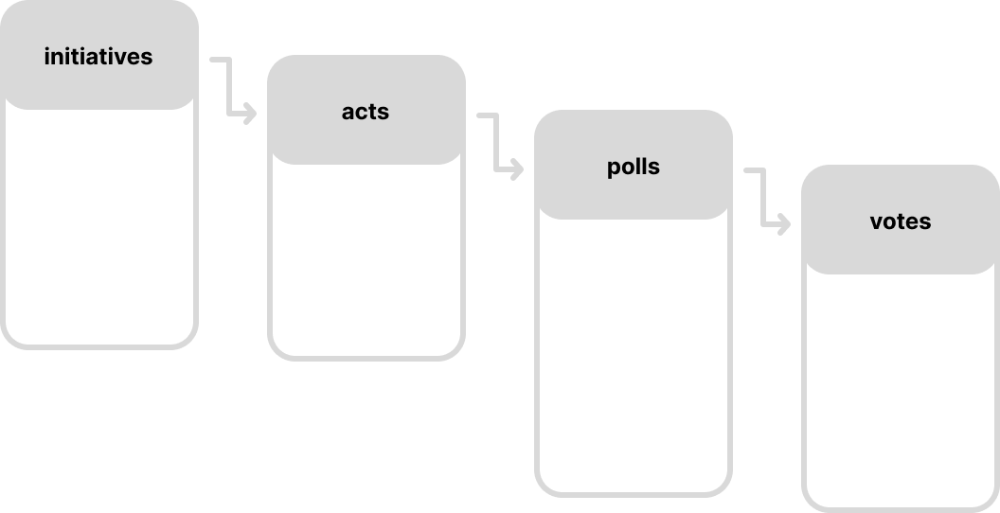

# IAssembleia

For the local agent I followed the DeepLearning.AI short course on ["Building Your Own Database Agent"](https://www.deeplearning.ai/short-courses/building-your-own-database-agent/).

---

## ✨ Features

- JSON data processing
- Local AI Agent (Azure OpenAI) that can chat with CSV files

---

## 💬 Azure OpenAI AI Agent that chats with CSV files

Check the [notebook](azure_llm.ipynb) to see how to implement a LangChain agent that can read a dataframe and answer context-aware questions!

## 📃 Data Processing and Analysis

1. **Source**: [Portuguese Parliament Initiatives](https://www.parlamento.pt/Cidadania/Paginas/DAIniciativas.aspx). A JSON file with all initiatives, acts, polls and votes for the 16th Legislature.

2. **Data structure**: Extracted the original schema manually from the JSON file. See more at [schema.json](data/raw/schema.json).

3. Used the [data_exploration](data_exploration.ipynb) notebook to explore the dataset and save the relevant info to CSV files. See all files at [data/processed](data/processed).

4. Final data structure and hierarchy: initiatives > acts > polls > votes.

<h4 align="center">
    
</h4>

---

## License

This project is licensed under the [Creative Commons Attribution-NonCommercial 4.0 International License](https://creativecommons.org/licenses/by-nc/4.0/).

You may use, share, and adapt this project for non-commercial purposes with proper attribution. Commercial use is not permitted.